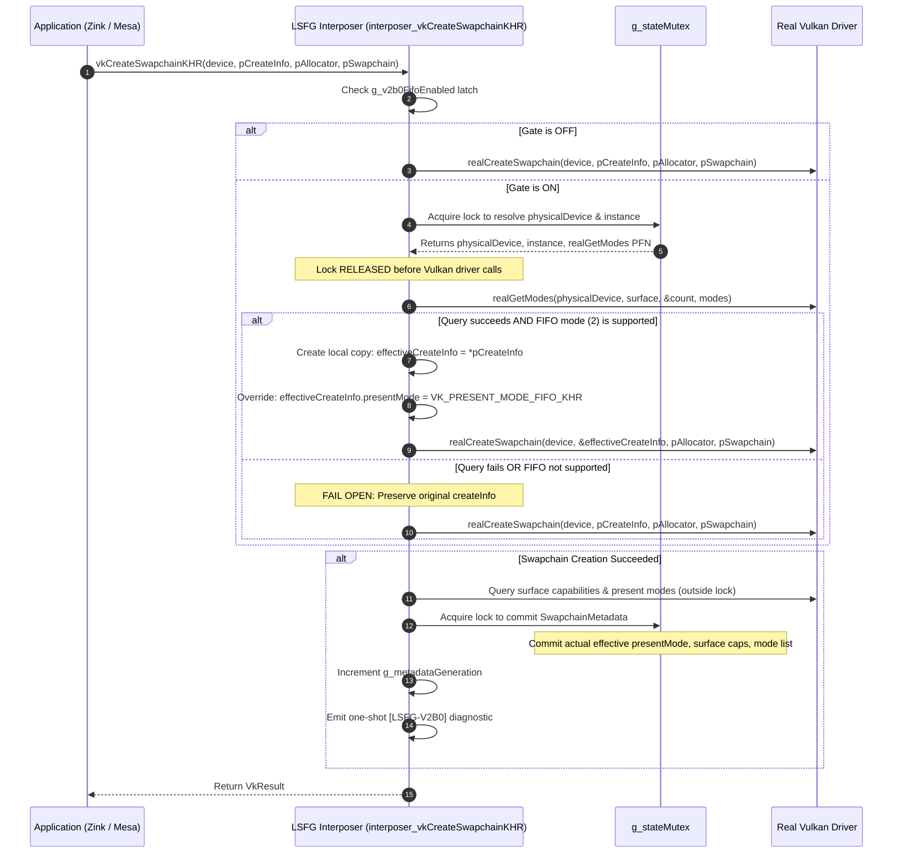
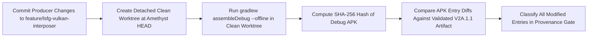

# LSFG V2B.0 — FIFO PASSIVE BASELINE ARCHITECTURAL DESIGN SPECIFICATION

**Document ID:** `SPEC-LSFG-V2B0-001`  
**Date:** 2026-08-28  
**Status:** PROPOSED / PENDING APPROVAL  
**Primary Repository:** `C:\Proyectos\SGSR` (`feature/android-lsfg-integration`)  
**Auxiliary Repository:** `C:\Proyectos\amethyst` (`feature/lsfg-vulkan-interposer`)  
**Auxiliary Repository:** `C:\Proyectos\LS-FG` (`feature/minecraft-fabric-lsfg`)  

---

## 1. Purpose & Objectives

The primary objective of milestone **LSFG V2B.0 (FIFO Passive Baseline)** is to physically prove a single architectural premise on the target Android hardware:

> **Can the active Android / Zink / Iris / SGSR1 presentation stack execute correctly when the application swapchain is created using `VK_PRESENT_MODE_FIFO_KHR` instead of `VK_PRESENT_MODE_MAILBOX_KHR`, while all other aspects of presentation remain completely passive?**

Milestone V2B.0 is an infrastructure and presentation-mode baseline test. It is **not** frame generation, **not** duplicate-frame transport, and **not** active LSFG synchronization.

### Key Validation Questions
1. Does the Vulkan driver on Adreno 740 / Android API 33 successfully create and present a swapchain with `VK_PRESENT_MODE_FIFO_KHR` when intercepted by the Amethyst Vulkan interposer?
2. Does Zink / Mesa behave stably when presenting into a FIFO swapchain without deadlocking, queue stalling, or dropping frames improperly?
3. Does presentation maintain strict 1:1 parity (`AcquireNextImageKHR` == `QueuePresentKHR`) with zero additional Vulkan submissions or active transport?
4. Can this presentation mode override be achieved via a transparent, opt-in runtime gate with zero production changes to the Minecraft Fabric mod or SGSR runtime?

---

## 2. Non-Goals & Architectural Boundaries

To ensure absolute safety and isolation of the presentation baseline, the following items are explicitly out of scope for V2B.0:

| Out-of-Scope Item | Rationale / Milestone |
| :--- | :--- |
| **Duplicate Frame Generation** | Reserved for Milestone V2B.1. |
| **Additional Acquire Calls (`vkAcquireNextImageKHR` / `2`)** | V2B.0 strictly enforces a 1:1 application acquire-to-present ratio. |
| **Additional Present Calls (`vkQueuePresentKHR`)** | Exactly one present per application frame. |
| **Vulkan Queue Submissions (`vkQueueSubmit` / `vkQueueSubmit2`)** | No command buffers or compute dispatches may be submitted by the interposer. |
| **Synchronization Objects (Fences, Semaphores)** | No LSFG-managed fences or semaphores are introduced. |
| **Layout Transitions, Blits, or Memory Copies** | Swapchain image contents and layouts remain untouched. |
| **LS-FG / SGSR Consumer Runtime Modifications** | Mod/Runtime code remains passive; no consumer changes are permitted for V2B.0. |
| **V1 or V2 Bridge ABI Modifications** | ABI layouts remain byte-for-byte identical to validated V2A.1.1. |

---

## 3. Current Physical Baseline (V2A.1.1 Reference)

Physical validation on the **AYN Odin 2 Portal** established the following authoritative baseline under V2A.1.1:

### Hardware & Environment
- **Device:** AYN Odin 2 Portal (Qualcomm Snapdragon 8 Gen 2 / Adreno 740)
- **OS:** Android 13 (API 33)
- **Application:** Minecraft 1.21.1 / Fabric 0.16.10 / PojavLauncher (Amethyst Plus)
- **Graphics Stack:** Zink / PurpleVK / Iris 1.8.8 / Complementary Reimagined r5.8.1
- **Upscaling:** SGSR1 @ 50% scale ($960\times540 \rightarrow 1920\times1080$)

### Authoritative Physical Vulkan Telemetry
- **Generation:** `7`
- **Swapchain Extent:** $1920\times1080$ (`minImageExtent`: $1\times1$, `maxImageExtent`: $4096\times4096$)
- **Image Format:** `VK_FORMAT_R8G8B8A8_UNORM` (numeric `37`)
- **Color Space:** `VK_COLOR_SPACE_SRGB_NONLINEAR_KHR` (numeric `0`)
- **Image Count:** `requestedMinImageCount = 3`, `actualImageCount = 4` (surface range: 3 to 64)
- **Image Usage:** `0x97` (`TRANSFER_SRC`, `TRANSFER_DST`, `SAMPLED`, `COLOR_ATTACHMENT`, `INPUT_ATTACHMENT`; `STORAGE` not enabled)
- **Surface Supported Usage:** `0x9F` (`STORAGE` supported by surface)
- **Transforms & Alpha:** `currentTransform = IDENTITY` (`0x1FF`), `compositeAlpha = INHERIT`
- **Presentation Queue:** Queue Family `0`, Queue Index `0`, Flags `0xF` (`GRAPHICS | COMPUTE | TRANSFER | SPARSE_BINDING`), Queue Count `1`
- **Physically Supported Present Modes:**
  - `VK_PRESENT_MODE_MAILBOX_KHR` (numeric `1`) — **SUPPORTED**
  - `VK_PRESENT_MODE_FIFO_KHR` (numeric `2`) — **SUPPORTED**
- **Active Present Mode in V2A.1.1:** `VK_PRESENT_MODE_MAILBOX_KHR` (numeric `1`)
- **Passive Presentation Counters (V2A.1.1 Test Run):**
  - `QueuePresentKHR`: 2120
  - `AcquireNextImageKHR`: 2120
  - `AcquireNextImage2KHR`: 0
  - `bridgeEligible`: 2120
  - `bridgeInvocations`: 2120
  - `bridgeAck`: 2120
  - `bridgeBadAck`: 0

---

## 4. Architectural Design Options & Trade-Off Analysis

Three candidate approaches were evaluated for implementing the FIFO presentation mode override:

```mermaid
flowchart TD
    subgraph Approach_A [Approach A: Intercept & Query at vkCreateSwapchainKHR]
        A1[vkCreateSwapchainKHR Entry] --> A2{Gate Enabled & Requested != FIFO?}
        A2 -- No --> A3[Call Real vkCreateSwapchainKHR with Original Info]
        A2 -- Yes --> A4[Query Surface Modes Outside Mutex]
        A4 --> A5{FIFO Supported?}
        A5 -- Yes --> A6[Shallow Copy CreateInfo & Set presentMode = FIFO]
        A5 -- No --> A3
        A6 --> A7[Call Real vkCreateSwapchainKHR with Modified Copy]
    end

    subgraph Approach_B [Approach B: Pre-cache Modes During Surface Enumeration]
        B1[Hook vkGetPhysicalDeviceSurfacePresentModesKHR] --> B2[Store Modes in Map physicalDevice, surface]
        B2 --> B3[vkCreateSwapchainKHR Entry]
        B3 --> B4{Cached Modes Found & FIFO Supported?}
        B4 -- Yes --> B5[Override presentMode = FIFO]
        B4 -- No --> B6[Fallback to Original CreateInfo]
    end

    subgraph Approach_C [Approach C: Unconditional FIFO Assumption]
        C1[vkCreateSwapchainKHR Entry] --> C2[Blindly Force presentMode = FIFO]
    end
```



### Approach Comparison Matrix

| Evaluation Dimension | Approach A: Query at Swapchain Create (Recommended) | Approach B: Pre-cache Modes Earlier | Approach C: Unconditional Assumption |
| :--- | :--- | :--- | :--- |
| **Driver Authoritativeness** | **100% Authoritative:** Queries real driver for the exact surface at creation time. | **Partial:** Relies on application querying modes first via intercepted entry point. | **Zero:** Assumes driver strictly follows Vulkan specification. |
| **Swapchain Recreation / Resize** | **Flawless:** Executes identical query/override for every recreation without state drift. | **Fragile:** Surface lifecycle/re-creation may miss cache updates. | **Flawless:** Always overrides. |
| **Fail-Open Robustness** | **Guaranteed:** If query fails or FIFO missing, cleanly falls back to original createInfo. | **Risk of False Fallback:** If app didn't call intercepted query, fails open unnecessarily. | **Unsafe:** If driver rejects FIFO on esoteric surface, causes fatal `VK_ERROR`. |
| **Locking & Thread Safety** | **Clean:** Queries executed outside `g_stateMutex`; metadata committed under lock. | **Complex:** Requires shared surface-to-mode map guarded by global mutex. | **Trivial:** No driver queries needed. |
| **Performance Overhead** | **Negligible:** 1 query only during swapchain creation/resize; 0 per-frame overhead. | **Zero at Create:** But adds hashing and map tracking overhead during enumeration. | **Zero overhead.** |

### Architectural Recommendation
**Approach A is selected as the authoritative design.** It guarantees complete fail-open robustness, strictly adheres to driver-authoritative query rules outside `g_stateMutex`, requires no complex cross-hook cache synchronization, and operates cleanly across initial swapchain creation and dynamic resizes.

---

## 5. Runtime Gate Architecture

To ensure strict opt-in semantics and complete backward compatibility with V2A.1.1, V2B.0 introduces an explicit native environment gate:

```text
AMETHYST_LSFG_V2B0_FIFO=1
```

### Gate Specification & Invariants
1. **Flag Name:** `AMETHYST_LSFG_V2B0_FIFO`
2. **Default State:** **OFF** (`false` / `0`). If absent, empty, or set to `0` / `false`, the interposer behaves identically to V2A.1.1.
3. **Activation State:** **ON** (`true` / `1`). Enabled when set to `"1"` or `"true"` (case-insensitive).
4. **Latch Point:** Latched exactly once during interposer initialization in `lsfg_interposer_init(void *realVulkanHandle)` inside `lsfg_vulkan_interposer.cpp`.
5. **Storage:** Stored in a global atomic boolean:
   ```cpp
   std::atomic<bool> g_v2b0FifoEnabled{false};
   ```
6. **No Hot-Path System Calls:** `getenv("AMETHYST_LSFG_V2B0_FIFO")` is **never** called in `vkQueuePresentKHR`, `vkAcquireNextImageKHR`, or per-frame hot paths.
7. **Independence:** Completely independent of `AMETHYST_LSFG_VULKAN_INTERPOSER=1` (which controls interposer injection) and Java mod properties. Disabling `AMETHYST_LSFG_V2B0_FIFO` leaves the V2A interposer active while restoring MAILBOX presentation.

---

## 6. Vulkan Interception & Swapchain Creation Flow

The complete execution flow within `interposer_vkCreateSwapchainKHR` is structured as follows:



---

## 7. Capability Resolution & Fail-Open Semantics

### Deterministic Support Query (`QueryAllPresentModes`)
Support determination uses the existing robust two-call / retry loop `QueryAllPresentModes`:
```cpp
bool QueryAllPresentModes(
    PFN_vkGetPhysicalDeviceSurfacePresentModesKHR realGetModes,
    VkPhysicalDevice physicalDevice,
    VkSurfaceKHR surface,
    std::vector<VkPresentModeKHR> &presentModes);
```
- First call with `pPresentModes = nullptr` to retrieve `modeCount`.
- Bounded retry loop (up to 8 attempts) to handle `VK_INCOMPLETE` if mode count changes dynamically.
- Verifies `std::find(presentModes.begin(), presentModes.end(), VK_PRESENT_MODE_FIFO_KHR) != presentModes.end()`.

### Fail-Open Matrix

| Scenario / Condition | Action Taken | Resulting `presentMode` | Swapchain Result |
| :--- | :--- | :--- | :--- |
| `g_v2b0FifoEnabled == false` | Pass original `pCreateInfo` | Original (`MAILBOX`) | Real driver result |
| `pCreateInfo->presentMode == VK_PRESENT_MODE_FIFO_KHR` | Pass original `pCreateInfo` (no override needed) | `FIFO` | Real driver result |
| `physicalDevice` or `surface` unmapped / null | Pass original `pCreateInfo` (Fail Open) | Original (`MAILBOX`) | Real driver result |
| `realGetModes` PFN resolution fails | Pass original `pCreateInfo` (Fail Open) | Original (`MAILBOX`) | Real driver result |
| `QueryAllPresentModes` returns `false` or error | Pass original `pCreateInfo` (Fail Open) | Original (`MAILBOX`) | Real driver result |
| `VK_PRESENT_MODE_FIFO_KHR` absent in supported modes | Pass original `pCreateInfo` (Fail Open) | Original (`MAILBOX`) | Real driver result |
| Support verified & Gate enabled | Pass `effectiveCreateInfo` (`presentMode = FIFO`) | `FIFO` | Real driver result |
| Real `vkCreateSwapchainKHR` fails | Propagate error code immediately | N/A | Failure returned; no metadata committed |

---

## 8. Swapchain CreateInfo Immutability & Safe Local Override

### Const Correctness & Memory Lifecycle
The caller's `const VkSwapchainCreateInfoKHR *pCreateInfo` is treated as strictly read-only.
- **Never cast away const** or mutate caller memory.
- When applying the override, allocate a local stack structure:
  ```cpp
  VkSwapchainCreateInfoKHR effectiveCreateInfo = *pCreateInfo;
  effectiveCreateInfo.presentMode = VK_PRESENT_MODE_FIFO_KHR;
  ```

### Pointer Member Safety Analysis
`VkSwapchainCreateInfoKHR` contains pointer members whose lifetimes and ownership must be preserved:
1. `pNext`: Points to extension structures owned by the application (e.g., `VkSwapchainPresentScalingCreateInfoEXT`). The caller guarantees valid lifetime for the synchronous duration of `vkCreateSwapchainKHR`. A shallow copy retains the exact pointer value.
2. `pQueueFamilyIndices`: Points to an array of queue family indices when `imageSharingMode == VK_SHARING_MODE_CONCURRENT`. The caller guarantees valid lifetime for the duration of the call. A shallow copy retains the exact pointer value.
3. `surface` and `oldSwapchain`: Non-dispatchable handles (64-bit scalars), copied by value.

No deep copying or dynamic allocations are performed, eliminating memory leaks and lifetime hazards.

---

## 9. Swapchain Recreation & Dynamic Resizing

V2B.0 natively supports multiple swapchain lifecycles:
1. **Initial Swapchain Creation:** Evaluates gate, verifies FIFO support, overrides mode, commits metadata.
2. **Dynamic Recreation / Window Resize:**
   - Application calls `vkCreateSwapchainKHR` with `pCreateInfo->oldSwapchain != VK_NULL_HANDLE`.
   - The interposer forwards `oldSwapchain` byte-for-byte in `effectiveCreateInfo`.
   - Evaluates FIFO support afresh for the surface, applies the override, and creates the new swapchain.
   - Updates `g_lastActiveSwapchain` and `g_swapchainMetadata`.
   - Bumps `g_metadataGeneration` only upon successful creation of the new swapchain.
3. **Swapchain Destruction (`vkDestroySwapchainKHR`):**
   - Cleans up `g_swapchainMetadata` and `g_swapchainToDevice`.
   - Resets `g_lastActiveSwapchain` if destroyed.
   - Bumps `g_metadataGeneration`.

---

## 10. Metadata Authority & Generation Semantics

### Effective vs. Requested Present Mode
To eliminate diagnostic ambiguity, `SwapchainMetadata` tracks both the requested mode and the effective mode:

```cpp
struct SwapchainMetadata {
    VkDevice device = VK_NULL_HANDLE;
    VkSwapchainKHR swapchain = VK_NULL_HANDLE;
    VkSurfaceKHR surface = VK_NULL_HANDLE;
    
    // Original application request
    VkPresentModeKHR requestedPresentMode = VK_PRESENT_MODE_MAILBOX_KHR;
    
    // Authoritative effective mode used in successful real vkCreateSwapchainKHR
    VkPresentModeKHR presentMode = VK_PRESENT_MODE_FIFO_KHR;
    
    // Diagnostic tracking
    bool fifoOverrideApplied = false;
    // ... remaining existing fields ...
};
```

### Snapshot V2 Guarantees
- `LsfgBridgeSnapshotV2.presentMode` **always** reports the authoritative **effective** present mode (`presentMode`).
- If V2B.0 successfully overrides MAILBOX with FIFO, `snapshot.presentMode` reports `VK_PRESENT_MODE_FIFO_KHR` (numeric `2`).
- Under no circumstances will the snapshot report `MAILBOX` if `FIFO` was used to create the swapchain.

### Strict Generation Increment Rules
`g_metadataGeneration` is incremented **only** on authoritative, successful state changes:
- $\checkmark$ `interposer_vkCreateDevice` (new device registered).
- $\checkmark$ `interposer_vkDestroyDevice` (device and associated resources removed).
- $\checkmark$ `interposer_vkCreateSwapchainKHR` (successful swapchain creation).
- $\checkmark$ `interposer_vkDestroySwapchainKHR` (swapchain removed).
- $\checkmark$ `interposer_vkGetSwapchainImagesKHR` (first observation of swapchain image handles).
- $\checkmark$ `ObservePresentationQueue` (first authoritative observation of queue-family properties).

`g_metadataGeneration` is **never** incremented for:
- $\times$ Reading the runtime gate.
- $\times$ Querying present modes or surface capabilities.
- $\times$ Failed swapchain creation calls.
- $\times$ Bridge snapshot reads (`lsfg_interposer_bridge_get_snapshot_v2`).
- $\times$ Redundant observation of identical queue or image metadata.

---

## 11. One-Shot Diagnostic (`[LSFG-V2B0]`) & Summary Telemetry

### Diagnostic Block Specification
A single, highly descriptive diagnostic block is logged upon swapchain creation outside the hot path:

```text
[LSFG-V2B0] gateEnabled=true swapchain=0x7b4a8e10 surface=0x7b4a1200 appRequestedMode=VK_PRESENT_MODE_MAILBOX_KHR(1) effectiveMode=VK_PRESENT_MODE_FIFO_KHR(2) fifoSupported=true queryResult=SUCCESS(count=2) overrideApplied=true fallbackReason=NONE requestedMinImageCount=3 actualImageCount=4 imageUsage=0x97 extent=1920x1080 format=VK_FORMAT_R8G8B8A8_UNORM(37) colorSpace=VK_COLOR_SPACE_SRGB_NONLINEAR_KHR(0)
```

### Fallback Reason Codes
- `NONE`: Override successfully applied.
- `GATE_DISABLED`: `AMETHYST_LSFG_V2B0_FIFO` is not set or set to 0.
- `ALREADY_FIFO`: Application already requested `VK_PRESENT_MODE_FIFO_KHR`.
- `UNMAPPED_DEVICE_OR_SURFACE`: Could not resolve `physicalDevice` or `surface`.
- `QUERY_FAILED`: Driver failed to enumerate surface present modes.
- `FIFO_UNSUPPORTED`: Driver enumerated present modes, but `VK_PRESENT_MODE_FIFO_KHR` was not listed.
- `REAL_CREATE_FAILED`: Driver failed swapchain creation with overridden createInfo.

### Authoritative Summary Counters
The interposer summary function (`lsfg_interposer_log_summary()`) is extended to report V2B.0 telemetry alongside V2A.1 counters:

```cpp
// V2B.0 Telemetry Counters
std::atomic<uint32_t> g_v2b0SwapchainCreateEligible{0};
std::atomic<uint32_t> g_v2b0FifoOverrideApplied{0};
std::atomic<uint32_t> g_v2b0FifoFallback{0};
std::atomic<uint32_t> g_v2b0UnexpectedActiveTransport{0}; // Strictly 0
```

Summary format emitted to Android logcat and stdout:
```text
[LSFG-VK-SUMMARY] gipa=... gdpa=... createSwapchain=1 acquire=2120 acquire2=0 present=2120 bridgeReg=1 bridgeEligible=2120 bridgeAck=2120 v2b0Gate=1 v2b0Eligible=1 v2b0Override=1 v2b0Fallback=0 v2b0ActiveTransport=0
```

---

## 12. Thread Safety & Locking Architecture

### Invariant: Zero Real Vulkan Driver Calls Under Mutex
Holding `g_stateMutex` while invoking Vulkan driver entry points is strictly prohibited. The interposer adheres to the three-phase lock protocol:

```text
Phase 1: State Resolution (LOCKED)
  └─ Acquire g_stateMutex
  └─ Read physicalDevice, instance, real function pointers
  └─ Release g_stateMutex

Phase 2: Driver Invocation (UNLOCKED)
  └─ Call vkGetPhysicalDeviceSurfacePresentModesKHR
  └─ Call real vkCreateSwapchainKHR
  └─ Call vkGetPhysicalDeviceSurfaceCapabilitiesKHR

Phase 3: Metadata Commit (LOCKED)
  └─ Acquire g_stateMutex
  └─ Store SwapchainMetadata in g_swapchainMetadata
  └─ Update g_lastActiveSwapchain
  └─ Bump g_metadataGeneration
  └─ Release g_stateMutex
```

---

## 13. ABI Stability & Cross-Repository Impact Analysis

### Bridge ABI Invariance
- **V1 Present Observer ABI:** **100% Identical.** Signature `PFN_lsfg_present_observer_v1` and acknowledgement code `0x4C534647` (`'LSFG'`) are unchanged.
- **V2 Snapshot ABI (`LsfgBridgeSnapshotV2`):** **100% Identical.** Struct layout, byte offsets, field ordering, and validMask bit definitions (`0x01` through `0x40`) remain identical to V2A.1.1. No fields are added or moved.
- **V2 Copy-Out APIs:** Signatures for `lsfg_interposer_bridge_get_swapchain_images_v2` and `lsfg_interposer_bridge_get_present_modes_v2` remain unchanged.

### Cross-Repository Impact Assessment

| Repository | Required Changes for V2B.0 | Rationale |
| :--- | :--- | :--- |
| `C:\Proyectos\amethyst` | **YES (Producer Implementation)** | Implements runtime gate latch, capability query, safe createInfo override, and `[LSFG-V2B0]` diagnostic block in `lsfg_vulkan_interposer.cpp`. |
| `C:\Proyectos\SGSR` | **NO Production Changes** | Adds automated V2B.0 regression/contract test suite `v2b0_contract_test.ps1`. Java/native production code is untouched. |
| `C:\Proyectos\LS-FG` | **NO Changes** | Fabric mod and native hook already consume `snapshot.presentMode` passively and decode FIFO. No modifications required. |

---

## 14. Passivity Verification & Strict Invariants

Milestone V2B.0 must preserve all passive invariants established in V2A.1.1:

1. **Acquire/Present Parity:** Every application frame consists of exactly 1 acquire and 1 present.
   $$\text{AcquireNextImageKHR} + \text{AcquireNextImage2KHR} == \text{QueuePresentKHR}$$
2. **Zero Injected Submissions:** No `vkQueueSubmit`, `vkQueueSubmit2`, or command buffer execution.
3. **Zero Injected Synchronization:** No `VkSemaphore` or `VkFence` creation, signaling, or waiting by the interposer.
4. **Zero Layout Transitions or Blits:** Swapchain image contents and pipeline barriers are untouched.
5. **Zero Frame Duplication:** No duplicate frames or interpolated frames are submitted.

---

## 15. Automated Verification & Contract Test Architecture

A dedicated PowerShell contract and static verification test is defined:
`C:\Proyectos\SGSR\native\lsfg-android\v2b0_contract_test.ps1`

### Contract Test Check Suite
1. **Runtime Gate Contract:**
   - Asserts `AMETHYST_LSFG_V2B0_FIFO` environment flag definition.
   - Asserts gate is latched during `lsfg_interposer_init` and stored in `std::atomic<bool>`.
   - Asserts zero `getenv` calls in presentation hot path.
2. **Capability Resolution & Safe Override:**
   - Verifies `QueryAllPresentModes` or equivalent driver query is invoked prior to override.
   - Verifies shallow copy of `VkSwapchainCreateInfoKHR` without casting away const.
   - Verifies fail-open branches when gate is disabled, FIFO is unsupported, or query fails.
3. **Locking & Driver Isolation:**
   - Scans all code paths containing `g_stateMutex` and asserts zero calls to `g_realGipa`, `g_realGdpa`, `realCreateSwapchain`, `realGetModes`, or `realGetCaps` while locked.
4. **Metadata & Diagnostic Correctness:**
   - Asserts `SwapchainMetadata` records effective `presentMode`.
   - Asserts `[LSFG-V2B0]` diagnostic contains all required labels.
   - Asserts `lsfg_interposer_log_summary()` includes V2B.0 counters.
5. **ABI & Passivity Stability:**
   - Verifies byte layout compatibility of `LsfgBridgeSnapshotV2`.
   - Verifies existing `v2a1_contract_test.ps1` remains 100% green (zero regressions).

---

## 16. Clean Build & Provenance Verification Strategy

When approved for implementation, build artifacts will be generated using the established clean worktree isolation protocol:



1. Commit changes cleanly on `feature/lsfg-vulkan-interposer`.
2. Spawn an isolated, detached build directory to prevent uncommitted working-tree contamination.
3. Execute clean offline Gradle build (`assembleDebug`).
4. Validate APK package ID `com.vairacing.amethystplus.debug`.
5. Perform strict binary diff classification against the validated V2A.1.1 baseline APK (`app_pojavlauncher-debug.apk`).
6. Stage build artifacts for user approval without deploying.

---

## 17. Future Physical Acceptance Criteria (AYN Odin 2 Portal)

Physical acceptance on hardware will require meeting all seven criteria during runtime:

1. **`[LSFG-V2B0]` Logcat Telemetry:**
   - `gateEnabled=true`
   - `appRequestedMode=VK_PRESENT_MODE_MAILBOX_KHR(1)`
   - `fifoSupported=true`
   - `effectiveMode=VK_PRESENT_MODE_FIFO_KHR(2)`
   - `overrideApplied=true`
2. **`[LSFG-V2A1]` Consumer Telemetry:**
   - `supportedPresentModes` lists `VK_PRESENT_MODE_MAILBOX_KHR (1)` and `VK_PRESENT_MODE_FIFO_KHR (2)`.
   - `presentMode=VK_PRESENT_MODE_FIFO_KHR (2)`.
3. **Swapchain Dimensions & Usage Invariance:**
   - Extent remains $1920\times1080$.
   - Format remains `VK_FORMAT_R8G8B8A8_UNORM` (`37`).
   - `actualImageCount` matches physical WSI capability ($\ge 3$, expected 4).
   - Usage flags remain unchanged (`0x97`).
4. **Strict Passivity Validation:**
   - `QueuePresentKHR == AcquireNextImageKHR`.
   - `AcquireNextImage2KHR == 0`.
   - Zero injected submissions or copies.
5. **Runtime Rendering Quality:**
   - Minecraft 1.21.1 / Iris 1.8.8 / Complementary Reimagined r5.8.1 renders cleanly.
   - SGSR1 50% upscaling operates normally.
   - No visual corruption, stutter loops, or swapchain starvation.
6. **Error-Free Execution:**
   - Zero `VK_ERROR` return codes.
   - Zero fatal `GL_INVALID` calls.
   - Zero black screens, ANRs, or native crashes.
7. **Clean Process Termination:**
   - Clean shutdown with zero deadlock in interposer or presentation queues.

---

## 18. Zero-Impact Rollback Procedure

If physical validation reveals unexpected driver starvation or latency under FIFO:

1. **Immediate Runtime Rollback:**
   Remove `AMETHYST_LSFG_V2B0_FIFO=1` from `custom_env.txt` or set `AMETHYST_LSFG_V2B0_FIFO=0`.
2. **Zero Code Changes Required:**
   The APK does not need to be recompiled or reinstalled. Disabling the environment flag immediately restores the validated V2A.1.1 MAILBOX baseline.
3. **No Mod or Profile Edits:**
   Minecraft Fabric profile, shaderpacks, and SGSR configuration remain 100% untouched.

---

## 19. Architectural Boundary to Milestone V2B.1

Milestone V2B.0 deliberately establishes the presentation mode foundation for **V2B.1 (Duplicate-Frame Active Transport)**. The boundary between milestones is strictly defined:

```text
┌─────────────────────────────────────────────────────────────────────────┐
│                          MILESTONE V2B.0 (THIS SPEC)                    │
│  - Swapchain Creation Mode: VK_PRESENT_MODE_FIFO_KHR                     │
│  - Application Acquire: 1                                               │
│  - Application Present: 1                                               │
│  - Transport: 100% PASSIVE (Zero extra calls, zero submissions)          │
└────────────────────────────────────┬────────────────────────────────────┘
                                     │ Validates FIFO stability on Adreno 740
                                     ▼
┌─────────────────────────────────────────────────────────────────────────┐
│                          MILESTONE V2B.1 (FUTURE SPEC)                  │
│  - Swapchain Creation Mode: Inherited FIFO from V2B.0                   │
│  - Active Transport: Dual-Acquire & Dual-Present Transport Loop         │
│  - Interposer Submissions: Image blit / copy / duplicate submission     │
│  - Explicit Synchronization: VkSemaphore / VkFence orchestration        │
└─────────────────────────────────────────────────────────────────────────┘
```

Detailed design and implementation of dual-acquire pacing, semaphore handoffs, and duplicate-frame dispatch will occur strictly after physical validation of V2B.0 succeeds.
