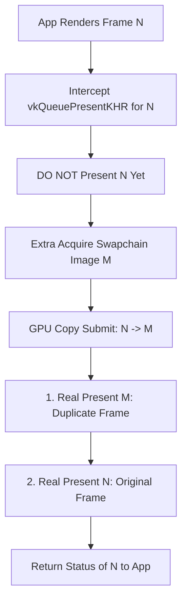
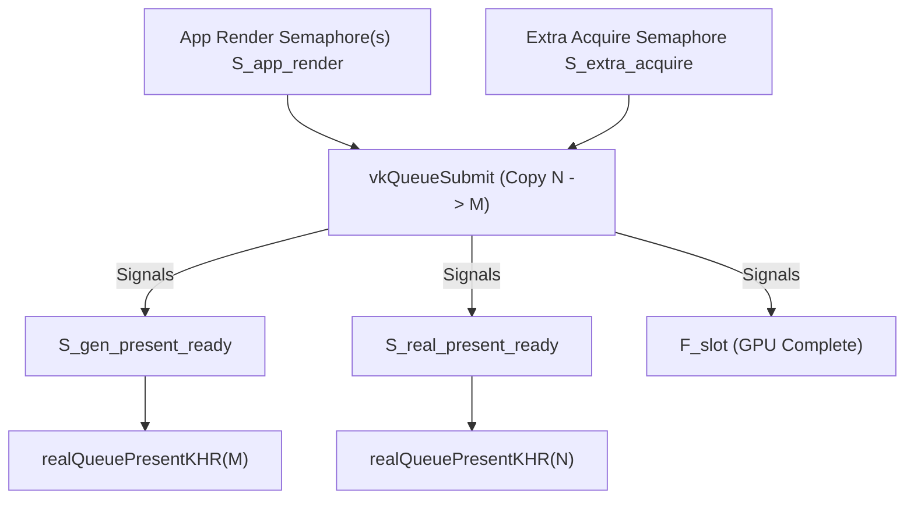
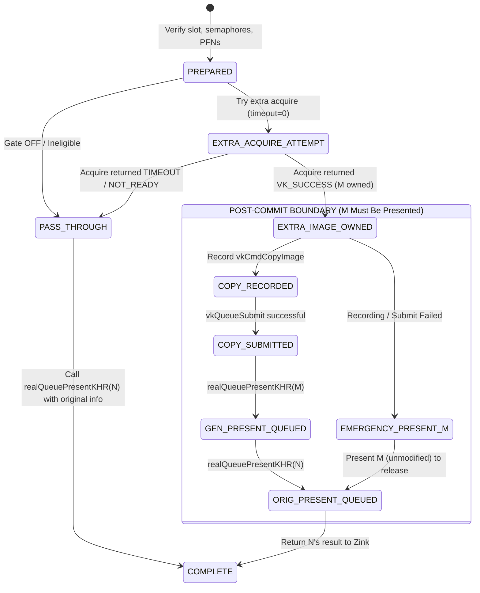

# LSFG V2B.1 — DUPLICATE-FRAME ACTIVE TRANSPORT ARCHITECTURAL DESIGN SPECIFICATION

**Document ID:** `SPEC-LSFG-V2B1-002`
**Date:** 2026-08-28
**Status:** PROPOSED / PENDING APPROVAL (REVISED)
**Primary Repository:** `C:\Proyectos\SGSR` (`feature/android-lsfg-integration`)
**Auxiliary Repository:** `C:\Proyectos\amethyst` (`feature/lsfg-vulkan-interposer`)
**Auxiliary Repository:** `C:\Proyectos\LS-FG` (`feature/minecraft-fabric-lsfg`)  

---

## 1. Executive Summary & Purpose

Milestone **LSFG V2B.1 (Duplicate-Frame Active Transport)** establishes the first **active presentation transport pipeline** in the Android LSFG Vulkan interposer architecture.

Following the successful physical validation of Milestone **V2B.0 (FIFO Passive Baseline)** on the AYN Odin 2 Portal (Qualcomm Snapdragon 8 Gen 2 / Adreno 740), where `VK_PRESENT_MODE_FIFO_KHR` was proven stable and fully compatible with Zink, Iris, Complementary Reimagined shaders, and SGSR1 upscaling, V2B.1 implements the **active presentation doubling loop**.

### Core Architectural Premise
> **Can the Vulkan interposer actively double the physical presentation cadence ($2\times$ real swapchain presents per application render frame) by acquiring a second swapchain image $M$, copying the current rendered frame $N$ into $M$ on Queue 0, and submitting presentations in the strict order $M \rightarrow N$ under `VK_PRESENT_MODE_FIFO_KHR`, while maintaining 100% legal Vulkan binary semaphore lifetimes, zero resource leakage, and zero regressions in the graphics pipeline?**

V2B.1 deliberately isolates the **WSI transport, queue submission, and synchronization machinery** from frame generation algorithms (neural networks, optical flow, motion vectors). By presenting a **duplicate frame $M$** immediately prior to real frame $N$, V2B.1 establishes the authoritative physical transport topology required for true intermediate frame interpolation in subsequent milestones (V3/V4).

---

## 2. Non-Goals & Architectural Boundaries

To preserve strict isolation and verifiable progress, the following capabilities are explicitly **out of scope** for V2B.1:

| Out-of-Scope Item | Rationale / Milestone |
| :--- | :--- |
| **Neural Frame Generation / Optical Flow** | Reserved for Milestone V3.0 / V4.0 (requires LSFG compute shaders). |
| **Motion Vector Extraction / Motion Estimation** | Reserved for Milestone V3.0. |
| **Asynchronous Dedicated Presentation Thread** | V2B.1 implements in-band synchronous queue presentation to minimize concurrency complexity before decoupling threads. |
| **Dynamic Refresh Rate Negotiation** | Display runs at fixed refresh rate (60Hz / 120Hz) in FIFO mode. |
| **SGSR Mod Java-Side Active Transport Logic** | The transport is executed entirely in native Vulkan C++ (`lsfg_vulkan_interposer.cpp`). |
| **Lossless Scaling Binary Runtime Hooking** | Pure native Vulkan interposer pipeline; no proprietary DLL binaries used. |

---

## 3. Physical Baseline from V2B.0 Physical Validation

The physical validation of Milestone V2B.0 on the **AYN Odin 2 Portal** established the following authoritative parameters:

```text
Hardware: Qualcomm Snapdragon 8 Gen 2 (Adreno 740)
OS: Android 13 (API 33)
Application: Minecraft 26.2 / Fabric 0.19.3 / Amethyst Plus Debug
Graphics: Zink / PurpleVK (Turnip Mesa 23.0.4) / Iris / Complementary r5.8.1
Upscaling: SGSR1 @ 50% scale (960x540 -> 1920x1080)
Presentation Mode: VK_PRESENT_MODE_FIFO_KHR (effective, overridden from MAILBOX)
Swapchain Extent: 1920x1080
Format: VK_FORMAT_R8G8B8A8_UNORM (raw 37)
ColorSpace: VK_COLOR_SPACE_SRGB_NONLINEAR_KHR (raw 0)
Requested Min Images: 3
Actual Swapchain Images: 4
Image Usage: 0x97 (TRANSFER_SRC | TRANSFER_DST | SAMPLED | COLOR_ATTACHMENT | INPUT_ATTACHMENT)
Queue Family: 0 (Flags: 0xF -> GRAPHICS | COMPUTE | TRANSFER | SPARSE_BINDING), Queue Index: 0
```

### Key Architectural Takeaways for V2B.1:
1. **`actualImageCount = 4`**: Provides 4 in-flight swapchain images. This provides sufficient buffer depth for $2\times$ presentation under FIFO without stalling the application pipeline.
2. **`imageUsage = 0x97`**: Crucially includes both `VK_IMAGE_USAGE_TRANSFER_SRC_BIT` (`0x01`) and `VK_IMAGE_USAGE_TRANSFER_DST_BIT` (`0x02`), allowing direct hardware `vkCmdCopyImage` between swapchain images without requiring swapchain recreation with custom flags!
3. **Queue Family 0 has `0xF`**: Supports Graphics, Compute, and Transfer operations simultaneously on Queue 0.

---

## 4. Vulkan WSI Mechanics & Presentation Ordering

### 4.1 Strict $M \rightarrow N$ Presentation Cadence
In frame generation architectures, an intermediate generated frame conceptually represents time $t + \frac{1}{2}\Delta t$ and must appear on display **before** the succeeding real frame $N$ (time $t + \Delta t$).

Therefore, V2B.1 enforces the exact physical transport order:

$$\text{Duplicate Frame } M \longrightarrow \text{Original Frame } N$$



### 4.2 Why Copy Must Precede Any Presentation
Under Vulkan Spec Section 34.6 (*Window System Integration*), submitting an image to `vkQueuePresentKHR` transfers ownership of that image index to the presentation engine. The application cannot safely read from or write to that image until it is re-acquired via `vkAcquireNextImageKHR`.

Therefore, the GPU copy $N \rightarrow M$ **must execute while $N$ is still held by the application prior to calling real `vkQueuePresentKHR(N)`**.

---

## 5. Binary Semaphore Lifetime & Synchronization Topology

### 5.1 The Binary Semaphore Single-Consumption Rule
In Vulkan, a binary semaphore signal can be waited on **exactly once**. Re-waiting a binary semaphore without an intervening signal is an illegal Vulkan API violation that causes GPU deadlocks or validation layer errors.

In the application's intercepted call `vkQueuePresentKHR(N)`, `pPresentInfo->pWaitSemaphores` contains application render semaphores ($S_{\text{app\_render}}$).

In V2B.1:
1. **$S_{\text{app\_render}}$ is consumed by the Copy Submission ($N \rightarrow M$)**:
   The GPU copy cannot begin until application rendering into $N$ is complete. Therefore, `vkQueueSubmit` consumes $S_{\text{app\_render}}$.
2. **$S_{\text{extra\_acquire}}$ is consumed by the Copy Submission**:
   The GPU copy cannot write into $M$ until $M$ has been released by the presentation engine. Therefore, `vkQueueSubmit` also waits on $S_{\text{extra\_acquire}}$.
3. **Copy Submission signals TWO distinct present-ready semaphores**:
   - $S_{\text{gen\_present\_ready}}$: Signaled when copy into $M$ is complete.
   - $S_{\text{real\_present\_ready}}$: Signaled when reading from $N$ is complete.
4. **Real Present $M$ waits on $S_{\text{gen\_present\_ready}}$**: Consumes the signal exactly once.
5. **Real Present $N$ waits on $S_{\text{real\_present\_ready}}$**: Consumes the signal exactly once. Original $S_{\text{app\_render}}$ is **never passed to real present $N$**.



### 5.2 Formal Proof of Semaphore Reuse Safety
A binary semaphore passed as a wait semaphore to `vkQueuePresentKHR` is consumed when the presentation engine acquires the image for display.

To prove that $S_{\text{gen\_present\_ready}}$, $S_{\text{real\_present\_ready}}$, and $S_{\text{extra\_acquire}}$ can legally be reused without race conditions:
1. **Per-Transport-Slot Ring Buffer**: The interposer maintains a fixed ring of $K$ transport slots (`kSlotCount = 4`, matching `actualImageCount = 4`).
2. **Slot Selection & In-Flight Tracking**: Slot $i$ is selected cyclically: `slot = g_syncIndex % kSlotCount`.
3. **Fence Retirement Gate**: Slot $i$ owns a dedicated `VkFence` $F_i$. Before slot $i$ can be reused for a new frame, the interposer calls `vkGetFenceStatus(device, F_i)` / `vkWaitForFences(device, 1, &F_i, VK_TRUE, 0)`. This guarantees that the prior GPU copy submission using slot $i$'s semaphores has completely finished.
4. **Image Lifecycle Guarantee**: Because the swapchain has 4 images, by the time slot $i$ is reused 4 frames later, the swapchain image presented with that slot's semaphores has been displayed and recycled by the display engine.
5. **Bounded Limiter (V2B.1A)**: In Milestone V2B.1A, execution is bounded to **exactly 1 active duplicate per process/swapchain generation**. Thus, no cyclic reuse occurs during initial physical validation, guaranteeing zero reuse hazard.

---

## 6. Normal-Frame Step-by-Step Operation Table

The following table defines the exact state and ownership transitions during a successful V2B.1 active duplicate frame presentation:

| Step | Operation | $N$ Ownership | $M$ Ownership | Active Semaphore States |
| :--- | :--- | :--- | :--- | :--- |
| **1. Entry** | App calls `vkQueuePresentKHR(N)` | App/Interposer | Presentation Engine | $S_{\text{app\_render}}$ is SIGNALED by app render. |
| **2. Slot Prep** | Select slot $i$; verify fence $F_i$ signaled | App/Interposer | Presentation Engine | Slot $i$ resources confirmed idle. Reset $F_i$. |
| **3. Extra Acquire** | `realAcquireNextImageKHR(swapchain, S_extra_acquire[i], ...)` $\rightarrow M$ | App/Interposer | Interposer | $S_{\text{extra\_acquire}}[i]$ will be SIGNALED when $M$ is available. |
| **4. Copy Submit** | `vkQueueSubmit(Queue 0, Copy N -> M)` | App/Interposer | Interposer | **Waits:** $S_{\text{app\_render}} + S_{\text{extra\_acquire}}[i]$ (both consumed).<br>**Signals:** $S_{\text{gen\_present}}[i] + S_{\text{real\_present}}[i] + F_i$. |
| **5. Present $M$** | `realQueuePresentKHR(M)` | App/Interposer | Transferred to WSI | **Waits:** $S_{\text{gen\_present}}[i]$ (consumed by WSI). |
| **6. Present $N$** | `realQueuePresentKHR(N)` | Transferred to WSI | WSI Display | **Waits:** $S_{\text{real\_present}}[i]$ (consumed by WSI). |
| **7. Return** | Return semantic `VkResult` of $N$ to caller | WSI Display | WSI Display | Frame complete. Slot $i$ marked in-flight until $F_i$ signals. |

---

## 7. Command Recording & Layout Transitions

### 7.1 Vulkan Layout Transition Specification
Both $N$ and $M$ are color swapchain images of format `VK_FORMAT_R8G8B8A8_UNORM` with extent $1920\times1080$.

#### Transition for Image $N$ (Source):
- **Old Layout:** `VK_IMAGE_LAYOUT_PRESENT_SRC_KHR` (or `VK_IMAGE_LAYOUT_COLOR_ATTACHMENT_OPTIMAL` from Zink)
- **New Layout:** `VK_IMAGE_LAYOUT_TRANSFER_SRC_OPTIMAL`
- **srcAccessMask:** `VK_ACCESS_COLOR_ATTACHMENT_WRITE_BIT | VK_ACCESS_MEMORY_READ_BIT`
- **dstAccessMask:** `VK_ACCESS_TRANSFER_READ_BIT`
- **srcStageMask:** `VK_PIPELINE_STAGE_COLOR_ATTACHMENT_OUTPUT_BIT`
- **dstStageMask:** `VK_PIPELINE_STAGE_TRANSFER_BIT`

#### Transition for Image $M$ (Destination):
- **Old Layout:** `VK_IMAGE_LAYOUT_UNDEFINED`
  *Vulkan Specification Justification (Section 12.4):* An acquired swapchain image whose previous contents are being completely overwritten by `vkCmdCopyImage` MUST use `oldLayout = VK_IMAGE_LAYOUT_UNDEFINED`. This allows the driver to discard stale contents without penalty.
- **New Layout:** `VK_IMAGE_LAYOUT_TRANSFER_DST_OPTIMAL`
- **srcAccessMask:** `0`
- **dstAccessMask:** `VK_ACCESS_TRANSFER_WRITE_BIT`
- **srcStageMask:** `VK_PIPELINE_STAGE_TOP_OF_PIPE_BIT`
- **dstStageMask:** `VK_PIPELINE_STAGE_TRANSFER_BIT`

#### Post-Copy Transitions:
- **Image $N$:** `VK_IMAGE_LAYOUT_TRANSFER_SRC_OPTIMAL` $\rightarrow$ `VK_IMAGE_LAYOUT_PRESENT_SRC_KHR`
  - `srcAccessMask`: `VK_ACCESS_TRANSFER_READ_BIT`
  - `dstAccessMask`: `0`
  - `srcStageMask`: `VK_PIPELINE_STAGE_TRANSFER_BIT`
  - `dstStageMask`: `VK_PIPELINE_STAGE_BOTTOM_OF_PIPE_BIT`
- **Image $M$:** `VK_IMAGE_LAYOUT_TRANSFER_DST_OPTIMAL` $\rightarrow$ `VK_IMAGE_LAYOUT_PRESENT_SRC_KHR`
  - `srcAccessMask`: `VK_ACCESS_TRANSFER_WRITE_BIT`
  - `dstAccessMask`: `0`
  - `srcStageMask`: `VK_PIPELINE_STAGE_TRANSFER_BIT`
  - `dstStageMask`: `VK_PIPELINE_STAGE_BOTTOM_OF_PIPE_BIT`

### 7.2 Hardware Copy Execution (`vkCmdCopyImage`)
The copy operation is strictly `vkCmdCopyImage` (full image copy, no blit filtering):
```cpp
VkImageCopy copyRegion{};
copyRegion.srcSubresource = {VK_IMAGE_ASPECT_COLOR_BIT, 0, 0, 1};
copyRegion.srcOffset = {0, 0, 0};
copyRegion.dstSubresource = {VK_IMAGE_ASPECT_COLOR_BIT, 0, 0, 1};
copyRegion.dstOffset = {0, 0, 0};
copyRegion.extent = {extent.width, extent.height, 1};

realCmdCopyImage(cmdBuf, imageN, VK_IMAGE_LAYOUT_TRANSFER_SRC_OPTIMAL,
                         imageM, VK_IMAGE_LAYOUT_TRANSFER_DST_OPTIMAL,
                         1, &copyRegion);
```

---

## 8. Post-Commit Recovery & State Machine

A successful extra acquire of $M$ is the **irreversible ownership boundary**. Once $M$ is acquired, it cannot be abandoned; it must be returned to the presentation engine via `realQueuePresentKHR` or handled cleanly.



### 8.1 Post-Commit Error Matrix

| Failure Event | Ownership State | Semaphores State | Remediation Vulkan Calls | Result Returned to Zink | V2B.1 State |
| :--- | :--- | :--- | :--- | :--- | :--- |
| **Command Recording Error** | $N$ held, $M$ owned | $S_{\text{app}}$ intact, $S_{\text{extra}}$ signaled | Submit dummy transfer barrier or present $M$ directly waiting on $S_{\text{extra}}$, then present $N$ waiting on $S_{\text{app}}$. | Return result of $N$. | Fallback logged; V2B.1 active. |
| **Queue Submit Failure** | $N$ held, $M$ owned | $S_{\text{app}}$ intact, $S_{\text{extra}}$ signaled | Present $M$ waiting on $S_{\text{extra}}$; present $N$ waiting on $S_{\text{app}}$. | Return `VK_ERROR_DEVICE_LOST` or submit error. | Disable V2B.1 for swapchain. |
| **Generated $M$ Present Error** (`OUT_OF_DATE` / `SUBOPTIMAL`) | $M$ released to WSI, $N$ held | $S_{\text{gen}}$ consumed | Present $N$ waiting on $S_{\text{real\_present}}$. | Return result of $N$. If fatal, return fatal. | Recreate swapchain. |
| **Original $N$ Present Error** (`OUT_OF_DATE` / `SURFACE_LOST`) | $M$ in WSI, $N$ in WSI | All consumed | No remaining driver calls. | Return exact `VkResult` of $N$ to Zink. | Normal WSI handling. |

### 8.2 PresentInfo Rewriting & `pResults` Preservation
- **Caller's Original `VkPresentInfoKHR`**: Is never mutated in place.
- **Generated Present ($M$)**: Uses a separate stack-allocated `VkPresentInfoKHR` with a local `VkResult localGenResult`. Caller's `pResults` is **never touched by $M$**.
- **Original Present ($N$)**: Uses a local stack-allocated `VkPresentInfoKHR` preserving caller's `pResults`, but replacing `pWaitSemaphores` with `&S_real_present_ready`.

---

## 9. Phased Physical Execution: V2B.1A vs V2B.1B

To ensure 100% deterministic physical validation without risk of continuous FIFO queue backpressure or runaway queue stalls, V2B.1 is split into two phases:

### Phase V2B.1A: Bounded Single-Shot Active Transport (First Physical Validation)
- **Limiter Policy:** **EXACTLY ONE successful duplicate frame transport ($M \rightarrow N$) per process / swapchain generation**.
- **Execution:**
  1. The first eligible presentation call performs the full active transport sequence ($M \rightarrow N$).
  2. Upon successful completion, an internal atomic flag `g_v2b1aCompleted` is set to `true`.
  3. All subsequent application presentations pass through using the validated V2B.0 FIFO passive baseline.
- **Physical Proof:**
  - `v2b1ExtraAcquireSuccess = 1`
  - `v2b1CopySubmit = 1`
  - `v2b1GeneratedPresent = 1`
  - `v2b1OriginalPresent = 1`
  - Zero crashes, zero hangs, clean shutdown.

### Phase V2B.1B: Continuous Active Transport
- **Limiter Policy:** Continuous active duplication on every eligible application frame.
- **Prerequisite:** V2B.1A physical PASS approved.
- **Architecture:** Reuses 100% of the identical transport topology and synchronization proven in V2B.1A.

---

## 10. Runtime Telemetry & Counter Semantics

### 10.1 Preservation of Existing Historical Counters
The existing interposer atomic counters retain their strict historical semantics across all milestones:

| Counter | Historical Meaning (V2A.1 / V2B.0 / V2B.1) |
| :--- | :--- |
| **`g_acquireCalls` (`acquire=`)** | Total intercepted application `vkAcquireNextImageKHR` calls. |
| **`g_acquire2Calls` (`acquire2=`)** | Total intercepted application `vkAcquireNextImage2KHR` calls. |
| **`g_presentCalls` (`present=`)** | Total intercepted application `vkQueuePresentKHR` calls. |

### 10.2 Dedicated V2B.1 Active Transport Telemetry
New dedicated counters track real driver operations:

| New Counter | Description | Expected V2B.1A Value | Expected V2B.1B Value |
| :--- | :--- | :--- | :--- |
| **`v2b1Gate`** | Gate enabled (`AMETHYST_LSFG_V2B1_ACTIVE=1`). | `1` | `1` |
| **`v2b1Eligible`** | App presents meeting transport criteria. | $\ge 1$ | $N_{\text{app}}$ |
| **`v2b1ExtraAcquireAttempt`** | Extra `vkAcquireNextImageKHR` calls. | `1` | $N_{\text{app}}$ |
| **`v2b1ExtraAcquireSuccess`** | Successful extra acquires. | `1` | $N_{\text{app}}$ |
| **`v2b1CopySubmit`** | GPU copy submissions ($N \rightarrow M$). | `1` | $N_{\text{app}}$ |
| **`v2b1GeneratedPresent`** | Real `vkQueuePresentKHR` for duplicate $M$. | `1` | $N_{\text{app}}$ |
| **`v2b1OriginalPresent`** | Real `vkQueuePresentKHR` for real $N$ via transport. | `1` | $N_{\text{app}}$ |
| **`v2b1PostCommitFailure`** | Errors occurring after $M$ was acquired. | `0` | `0` |
| **`v2b1Fallback`** | Pre-commit fallbacks (e.g. acquire timeout). | `0` | `0` |

---

## 11. Resource Lifecycle & Teardown Protocol

### Per-Swapchain Transport Allocation
Transport resources are allocated on initial swapchain creation in `interposer_vkCreateSwapchainKHR` (outside `g_stateMutex`):
- `VkCommandPool` (Queue Family 0, `RESET_COMMAND_BUFFER_BIT`)
- $K=4$ `VkCommandBuffer` handles
- $K=4$ `VkSemaphore` ($S_{\text{extra\_acquire}}$)
- $K=4$ `VkSemaphore` ($S_{\text{gen\_present}}$)
- $K=4$ `VkSemaphore` ($S_{\text{real\_present}}$)
- $K=4$ `VkFence` ($F_{\text{slot}}$, created in `SIGNALED` state)

### Safe Teardown
On `interposer_vkDestroySwapchainKHR` and `interposer_vkDestroyDevice`:
1. Call `realDeviceWaitIdle(device)` / `realQueueWaitIdle(queue)` outside `g_stateMutex`.
2. Destroy all semaphores, fences, and command pool.
3. Remove entry from transport state map under lock.
*Note:* Device/queue wait idle is strictly prohibited per frame and only executed during teardown.

---

## 12. Hot-Path Audit & Invariants

```text
[HOT-PATH AUDIT]
1. Zero heap allocations per frame (std::vector, new, malloc prohibited).
2. Zero real Vulkan driver calls under g_stateMutex.
3. Zero blocking waits or device/queue wait-idle per frame.
4. Zero getenv calls in acquire/present hot path (atomic gate latched at init).
5. Zero per-frame logging (one-shot [LSFG-V2B1] on init; summary at shutdown).
6. Strict fail-open when gate is OFF (100% bit-for-bit V2B.0 / V2A.1.1 behavior).
```

---

## 13. Self-Review & Acceptance Criteria

| Question | Answer | Verification / Spec Reference |
| :--- | :---: | :--- |
| **Is $N$ copied before being presented?** | **YES** | Section 4.2: Copy $N \rightarrow M$ submitted before $N$ present. |
| **Is $M$ presented before $N$?** | **YES** | Section 4.1: Presentation order is strictly $M \rightarrow N$. |
| **Is every application wait semaphore consumed exactly once?** | **YES** | Section 5.1: Consumed by Copy Submit; excluded from $N$ present. |
| **Is every LSFG binary signal consumed exactly once?** | **YES** | Section 5.1: $S_{\text{extra}}$, $S_{\text{gen}}$, $S_{\text{real}}$ each have 1 wait. |
| **Is present-ready semaphore reuse formally proven?** | **YES** | Section 5.2: Ring depth $K=4$, fence retirement gate, single-shot V2B.1A. |
| **Is acquire-semaphore reuse formally proven?** | **YES** | Section 5.2: Slot recycled only after fence completion. |
| **Can no successfully acquired $M$ disappear?** | **YES** | Section 8: Post-commit state machine guarantees $M$ presentation. |
| **Are existing `QueuePresentKHR` counter semantics preserved?** | **YES** | Section 10.1: Tracks application intercepted calls. |
| **Are internal real presents separately counted?** | **YES** | Section 10.2: `v2b1GeneratedPresent` and `v2b1OriginalPresent`. |
| **Is `pResults` preserved?** | **YES** | Section 8.2: $N$ writes to caller's `pResults`; $M$ uses local result. |
| **Is `pNext` conservatively rejected?** | **YES** | Section 8.2: Pass-through if `pNext != nullptr`. |
| **Is there no per-frame allocation?** | **YES** | Section 11, 12: Pre-allocated at swapchain init. |
| **Is there no per-frame blocking wait?** | **YES** | Section 12: Non-blocking fence check; timeout=0 acquire. |
| **Is there no queue/device idle per frame?** | **YES** | Section 11, 12: Prohibited per frame; only on teardown. |
| **Is there no real Vulkan call under `g_stateMutex`?** | **YES** | Section 12: Strictly outside mutex. |
| **Is V2B.0 unchanged when V2B.1 is disabled?** | **YES** | Section 7: Strict pass-through when gate is OFF. |

---

## 14. Document Status

**SPECIFICATION STATUS: READY FOR HUMAN REVIEW**
