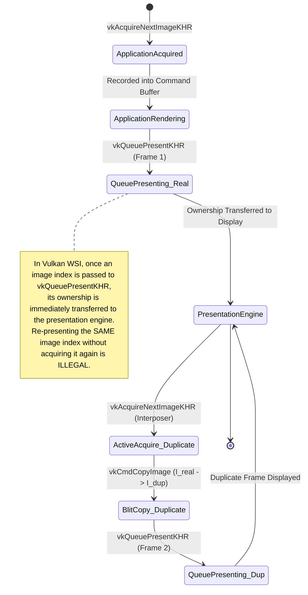
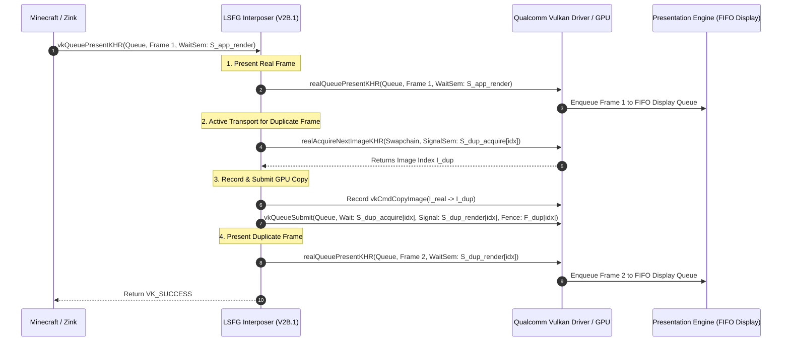
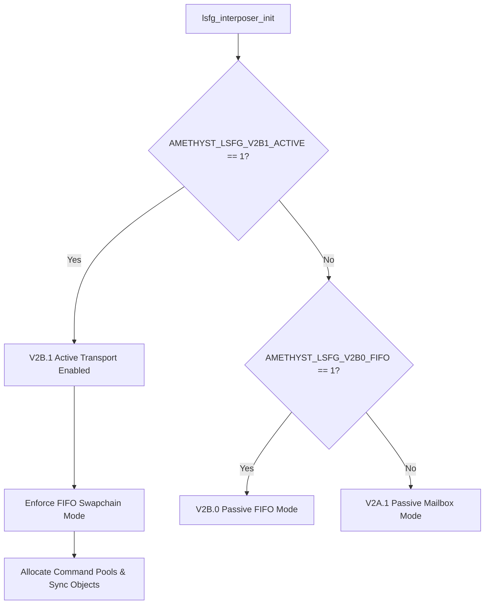

# LSFG V2B.1 — DUPLICATE-FRAME ACTIVE TRANSPORT ARCHITECTURAL DESIGN SPECIFICATION

**Document ID:** `SPEC-LSFG-V2B1-001`  
**Date:** 2026-08-28  
**Status:** PROPOSED / PENDING APPROVAL  
**Primary Repository:** `C:\Proyectos\SGSR` (`feature/android-lsfg-integration`)  
**Auxiliary Repository:** `C:\Proyectos\amethyst` (`feature/lsfg-vulkan-interposer`)  
**Auxiliary Repository:** `C:\Proyectos\LS-FG` (`feature/minecraft-fabric-lsfg`)  

---

## 1. Executive Summary & Purpose

Milestone **LSFG V2B.1 (Duplicate-Frame Active Transport)** is the pivotal transition from *passive observation* to **active presentation manipulation** in the Android LSFG pipeline.

Following the successful physical validation of Milestone **V2B.0 (FIFO Passive Baseline)** on the AYN Odin 2 Portal (Qualcomm Snapdragon 8 Gen 2 / Adreno 740), where `VK_PRESENT_MODE_FIFO_KHR` was proven stable and fully compatible with Zink, Iris, Complementary Reimagined shaders, and SGSR1 upscaling, V2B.1 implements the **first active $2\times$ presentation transport loop**.

### Core Architectural Premise
> **Can the Vulkan interposer actively double the presentation cadence ($2\times$ swapchain presents per application render frame) by acquiring a second swapchain image, blitting/copying the current rendered frame into it, and submitting a second present call under `VK_PRESENT_MODE_FIFO_KHR`, while maintaining rock-solid synchronization and zero regressions in the graphics pipeline?**

V2B.1 deliberately isolates the **WSI transport, queue submission, and synchronization machinery** from frame generation algorithms (neural networks, optical flow, motion vectors). By presenting a **duplicate frame** as the generated frame, V2B.1 establishes the physical transport baseline required for true frame interpolation in subsequent milestones (V3/V4).

---

## 2. Non-Goals & Architectural Boundaries

To preserve strict isolation and verifiable progress, the following capabilities are explicitly **out of scope** for V2B.1:

| Out-of-Scope Item | Rationale / Milestone |
| :--- | :--- |
| **Neural Frame Generation / Optical Flow** | Reserved for Milestone V3.0 / V4.0 (requires LSFG compute shaders). |
| **Motion Vector Extraction / Motion Estimation** | Reserved for Milestone V3.0. |
| **Asynchronous Dedicated Presentation Thread** | V2B.1 implements in-band synchronous queue presentation to minimize concurrency complexity and latency before decoupling threads. |
| **Dynamic Refresh Rate Negotiation** | Display runs at fixed refresh rate (60Hz / 120Hz) in FIFO mode. |
| **SGSR Mod Java-Side Active Transport Logic** | The transport is executed entirely in native Vulkan C++ (`lsfg_vulkan_interposer.cpp`). |
| **Lossless Scaling Binary Runtime Hooking** | Pure native Vulkan interposer pipeline; no proprietary DLL binaries used. |

---

## 3. Physical Baseline from V2B.0 Physical Validation

The physical validation of Milestone V2B.0 on the **AYN Odin 2 Portal** established the following authoritative parameters:

```text
Hardware: Qualcomm Snapdragon 8 Gen 2 (Adreno 740)
OS: Android 13 (API 33)
Application: Minecraft 26.2 / Fabric 0.19.3 / Amethyst Plus Debug
Graphics: Zink / PurpleVK (Turnip Mesa 23.0.4) / Iris / Complementary r5.8.1
Upscaling: SGSR1 @ 50% scale (960x540 -> 1920x1080)
Presentation Mode: VK_PRESENT_MODE_FIFO_KHR (effective, overridden from MAILBOX)
Swapchain Extent: 1920x1080
Format: VK_FORMAT_R8G8B8A8_UNORM (raw 37)
ColorSpace: VK_COLOR_SPACE_SRGB_NONLINEAR_KHR (raw 0)
Requested Min Images: 3
Actual Swapchain Images: 4
Image Usage: 0x97 (TRANSFER_SRC | TRANSFER_DST | SAMPLED | COLOR_ATTACHMENT | INPUT_ATTACHMENT)
Queue Family: 0 (Flags: 0xF -> GRAPHICS | COMPUTE | TRANSFER | SPARSE_BINDING), Queue Index: 0
```

### Key Architectural Takeaways for V2B.1:
1. **`actualImageCount = 4`**: Provides 4 in-flight swapchain images. This is sufficient buffer depth for $2\times$ presentation under FIFO without stalling the application pipeline.
2. **`imageUsage = 0x97`**: Crucially includes both `VK_IMAGE_USAGE_TRANSFER_SRC_BIT` (`0x01`) and `VK_IMAGE_USAGE_TRANSFER_DST_BIT` (`0x02`), allowing direct hardware `vkCmdCopyImage` or `vkCmdBlitImage` between swapchain images without requiring swapchain recreation with custom flags!
3. **Queue Family 0 has `0xF`**: Supports Graphics, Compute, and Transfer operations simultaneously on Queue 0.

---

## 4. Vulkan WSI Mechanics & Image Ownership Constraints

Under the Vulkan specification (Section 34.6 *Window System Integration (WSI)*), the lifecycle of a swapchain image is strictly governed by state ownership rules:



### Why "Double Presenting" the Same Image Handle is Invalid
Vulkan specification explicitly forbids submitting `vkQueuePresentKHR` twice for the same `pImageIndices[i]` without an intervening `vkAcquireNextImageKHR`. Doing so results in undefined driver behavior, presentation queue hangs, or `VK_ERROR_DEVICE_LOST` on Android WSI.

### Authoritative V2B.1 Transport Solution: The 2-Acquire / 2-Present Loop
For every single application presentation call:
1. **Frame 1 (Real Frame)**:
   - Application renders into acquired image $I_{\text{real}}$.
   - Application calls `vkQueuePresentKHR(queue, &presentInfo)`.
   - Interposer intercepts the call.
2. **Frame 1 Dispatch**:
   - Interposer presents $I_{\text{real}}$ immediately with its associated wait semaphores ($S_{\text{app\_render}}$).
3. **Frame 2 (Duplicate Frame Transport)**:
   - Interposer immediately calls `realAcquireNextImageKHR` on the device/swapchain to acquire a second image index $I_{\text{dup}}$, utilizing a dedicated internal semaphore $S_{\text{dup\_acquire}}$.
   - Interposer records/executes a command buffer on Queue 0 that copies $I_{\text{real}} \rightarrow I_{\text{dup}}$ via `vkCmdCopyImage` (or `vkCmdBlitImage`).
   - The copy submission waits on $S_{\text{dup\_acquire}}$ and signals $S_{\text{dup\_render}}$.
   - Interposer calls `realQueuePresentKHR` for $I_{\text{dup}}$, waiting on $S_{\text{dup\_render}}$.

---

## 5. Architectural Design Options & Trade-Off Analysis

Three design options were analyzed for the duplicate-frame active transport architecture:

```mermaid
flowchart TD
    subgraph Option_A [Option A: In-Band Synchronous Copy & Present (Recommended)]
        A1[App vkQueuePresentKHR] --> A2[Execute Real Present 1: Frame A]
        A2 --> A3[Acquire Next Swapchain Image: Frame B]
        A3 --> A4[Submit GPU Copy: Image A -> Image B]
        A4 --> A5[Execute Real Present 2: Frame B]
        A5 --> A6[Return VK_SUCCESS to App]
    end

    subgraph Option_B [Option B: Asynchronous Worker Thread with Ring Buffer]
        B1[App vkQueuePresentKHR] --> B2[Push Metadata to Ring Buffer]
        B2 --> B3[Worker Thread Wakes Up]
        B3 --> B4[Acquire Image B & Submit Copy]
        B4 --> B5[Present Frame B Asynchronously]
    end

    subgraph Option_C [Option C: Double-Buffering Offscreen Render Target]
        C1[Hook vkCreateSwapchainKHR] --> C2[Allocate Offscreen Target]
        C2 --> C3[App renders into Offscreen]
        C3 --> C4[Interposer presents twice from Offscreen]
    end
```

### Comparative Analysis Matrix

| Criterion | Option A: In-Band Synchronous (Recommended) | Option B: Dedicated Thread | Option C: Offscreen Render Target |
| :--- | :--- | :--- | :--- |
| **Architectural Complexity** | **Low / Deterministic**: Linear execution inside intercepted present hook. | **High**: Requires inter-thread synchronization, thread pacing, and mutex contention handling. | **Very High**: Requires redirecting all Zink framebuffer bindings and deep render target hacking. |
| **Vulkan Validation & Safety** | **100% Spec Compliant**: Standard semaphore dependency chains on Queue 0. | **Risk of Queue Contention**: Multi-threaded queue submission on same `VkQueue`. | **Fragile**: High risk of breaking Zink/Iris custom framebuffer attachments. |
| **Latency Impact** | **Minimal**: GPU copy overhead is $<0.2\text{ ms}$ on Adreno 740 at $1920\times1080$. | **Variable**: Thread scheduling jitter on Android big.LITTLE cores. | **High**: Extra copy on every frame. |
| **Fail-Open Resilience** | **Immediate**: If second acquire times out or fails, skip duplicate frame and return. | **Complex**: Requires tracking asynchronous thread errors back to main thread. | **Hard**: Failure in offscreen target breaks entire rendering pipeline. |
| **Suitability for Milestone** | **Optimal for V2B.1**: Validates active transport fundamentals with minimum moving parts. | Future (V3.1/V4 for neural decoupling). | Suboptimal. |

### Decision: **Option A (In-Band Synchronous Active Transport)** is selected for LSFG V2B.1.

---

## 6. Detailed System Architecture

### 6.1 Per-Swapchain Transport Resources (`V2B1TransportState`)

For each active swapchain, the interposer allocates and manages dedicated Vulkan transport resources:

```cpp
struct V2B1TransportState {
    bool initialized{false};
    VkDevice device{VK_NULL_HANDLE};
    VkQueue queue{VK_NULL_HANDLE};
    uint32_t queueFamilyIndex{0};
    
    // Command infrastructure
    VkCommandPool commandPool{VK_NULL_HANDLE};
    std::vector<VkCommandBuffer> copyCommandBuffers; // 1 per swapchain image
    
    // Synchronization primitives (ring of resources for in-flight duplicate frames)
    static constexpr size_t kMaxInFlight = 4;
    struct FrameSync {
        VkSemaphore dupAcquireSemaphore{VK_NULL_HANDLE};
        VkSemaphore dupRenderSemaphore{VK_NULL_HANDLE};
        VkFence dupFence{VK_NULL_HANDLE};
        bool fenceInFlight{false};
    };
    std::vector<FrameSync> syncPool;
    uint32_t syncIndex{0};
    
    // Cached swapchain properties
    VkExtent2D extent{0, 0};
    VkFormat format{VK_FORMAT_UNDEFINED};
    uint32_t imageCount{0};
    std::vector<VkImage> swapchainImages;
};
```

### 6.2 Synchronization & Semaphore Dependency Graph



### 6.3 Detailed Step-by-Step Presentation Logic

1. **Gate Check**: If `g_v2b1ActiveTransportEnabled` is `false`, the interposer executes the standard passive path (V2B.0 / V2A.1.1).
2. **First Present (Real Frame)**:
   - Call `realQueuePresentKHR(queue, pPresentInfo)` forwarding application semaphores directly.
   - If real present fails (e.g. `VK_ERROR_OUT_OF_DATE_KHR`), return immediately without generating a duplicate frame.
3. **Synchronization Ring Advancement**:
   - Select next `FrameSync` entry: `syncIndex = (syncIndex + 1) % kMaxInFlight`.
   - If `syncPool[syncIndex].fenceInFlight`, wait with bounded timeout (`16ms`) via `vkWaitForFences`, then reset fence.
4. **Second Acquire**:
   - Call `realAcquireNextImageKHR(device, swapchain, 0 /* immediate/bounded */, syncPool[syncIndex].dupAcquireSemaphore, VK_NULL_HANDLE, &dupImageIndex)`.
   - If acquire returns `VK_NOT_READY`, `VK_TIMEOUT`, or error, increment `g_v2b1Fallback` counter and return `VK_SUCCESS` (fail-open; do not stall the game loop).
5. **Command Buffer Execution**:
   - Begin primary command buffer for `dupImageIndex`.
   - Pipeline barrier: Transition $I_{\text{real}}$ to `VK_IMAGE_LAYOUT_TRANSFER_SRC_OPTIMAL` and $I_{\text{dup}}$ to `VK_IMAGE_LAYOUT_TRANSFER_DST_OPTIMAL`.
   - `vkCmdCopyImage`: Copy entire $1920\times1080$ subresource from $I_{\text{real}}$ to $I_{\text{dup}}$.
   - Pipeline barrier: Transition $I_{\text{dup}}$ to `VK_IMAGE_LAYOUT_PRESENT_SRC_KHR`.
   - End command buffer.
6. **Queue Submission**:
   - `VkSubmitInfo`:
     - Wait Semaphores: `dupAcquireSemaphore` (Stage: `VK_PIPELINE_STAGE_TRANSFER_BIT`).
     - Command Buffers: `copyCommandBuffers[dupImageIndex]`.
     - Signal Semaphores: `dupRenderSemaphore`.
   - Call `realQueueSubmit(queue, 1, &submitInfo, syncPool[syncIndex].dupFence)`.
7. **Second Present (Duplicate Frame)**:
   - `VkPresentInfoKHR dupPresentInfo`:
     - `waitSemaphoreCount = 1`, `pWaitSemaphores = &syncPool[syncIndex].dupRenderSemaphore`.
     - `swapchainCount = 1`, `pSwapchains = &swapchain`, `pImageIndices = &dupImageIndex`.
   - Call `realQueuePresentKHR(queue, &dupPresentInfo)`.
   - Increment `g_v2b1ExtraPresent` atomic counter.
8. **Return**: Return `VK_SUCCESS` to application.

---

## 7. Runtime Gate Architecture & Configuration

Milestone V2B.1 establishes a dedicated, independent native environment gate:

```text
AMETHYST_LSFG_V2B1_ACTIVE=1
```

### Gate Hierarchy & Fallback State Machine



### Gate Specifications:
1. **Flag Name:** `AMETHYST_LSFG_V2B1_ACTIVE`
2. **Default:** `0` / `false` (OFF).
3. **Activation:** Latched once in `lsfg_interposer_init`.
4. **Co-requisite:** When V2B.1 is ON, `VK_PRESENT_MODE_FIFO_KHR` is automatically enforced on the swapchain (inheriting V2B.0 logic).
5. **No System Calls in Hot Path:** Evaluated via `std::atomic<bool> g_v2b1ActiveTransportEnabled`.

---

## 8. Thread Safety, Locking Rules & Resource Cleanup

### Strict Locking Rules
To prevent Vulkan driver deadlocks:
1. **Zero Real Vulkan Calls Inside `g_stateMutex`**: All `vkQueueSubmit`, `vkAcquireNextImageKHR`, `vkQueuePresentKHR`, `vkAllocateCommandBuffers`, and `vkCreateSemaphore` calls MUST execute strictly **outside** `g_stateMutex`.
2. **State Map Protection**: Access to `V2B1TransportState` map is guarded by `g_stateMutex` only for pointer lookup and ref-counting.

### Cleanup Protocol
On `interposer_vkDestroySwapchainKHR` and `interposer_vkDestroyDevice`:
1. Call `vkQueueWaitIdle(queue)` or `vkDeviceWaitIdle(device)` outside lock to ensure GPU is done with duplicate frames.
2. Destroy all `dupAcquireSemaphore`, `dupRenderSemaphore`, `dupFence` handles.
3. Free command buffers and destroy `commandPool`.
4. Clear `V2B1TransportState` entry for destroyed handle.

---

## 9. Telemetry & Diagnostic Logging

### 9.1 One-Shot Diagnostic Block `[LSFG-V2B1]`
Emitted exactly once upon initial successful transport initialization:

```text
[LSFG-V2B1] gateEnabled=true swapchain=0x724126c070 queue=0x71f1e206b0 queueFamily=0 extent=1920x1080 format=VK_FORMAT_R8G8B8A8_UNORM(37) imageCount=4 poolCreated=true syncPoolSize=4 transportMode=IN_BAND_SYNC_BLIT
```

### 9.2 Telemetry Counters in `[LSFG-VK-SUMMARY]`
The interposer summary is extended with authoritative active transport counters:

```text
[LSFG-VK-SUMMARY] ... v2b0Gate=1 v2b0Eligible=1 v2b0Override=1 v2b0Fallback=0 v2b1Gate=1 v2b1Eligible=%u v2b1ExtraAcquire=%u v2b1ExtraPresent=%u v2b1Submits=%u v2b1CopyErrors=%u v2b1Fallback=%u
```

### Expected WSI Counter Relationships Under V2B.1:
- $\text{AcquireNextImageKHR} \approx 2 \times \text{AppFrames}$ (App acquires + Interposer extra acquires)
- $\text{QueuePresentKHR} = 2 \times \text{AppFrames}$ ($\text{AppPresents} + \text{v2b1ExtraPresent}$)
- $\text{v2b1ExtraAcquire} == \text{v2b1ExtraPresent} == \text{v2b1Submits}$
- $\text{v2b1CopyErrors} == 0$
- $\text{v2b1Fallback} == 0$

---

## 10. Verification Plan & Test-Driven Development (TDD)

### 10.1 Automated Contract Tests (`v2b1_contract_test.ps1`)
Prior to production implementation, an automated contract test suite will be created to enforce:
1. `AMETHYST_LSFG_V2B1_ACTIVE` latching at native initialization.
2. Transport resource allocation outside `g_stateMutex`.
3. Command buffer recording and image copy barrier compliance.
4. Two-phase present execution in `interposer_vkQueuePresentKHR`.
5. Fail-open fallback when second acquire is unavailable.
6. Clean destruction of command pools and synchronization primitives.
7. Zero regressions against `v2b0_contract_test.ps1` and `v2a1_contract_test.ps1`.

### 10.2 Physical Hardware Validation Steps (AYN Odin 2 Portal)
1. Clean detached worktree build of Amethyst Debug APK.
2. Provenance gate against validated baseline.
3. Configure `custom_env.txt`:
   ```text
   AMETHYST_LSFG_VULKAN_INTERPOSER=1
   AMETHYST_LSFG_V2B0_FIFO=1
   AMETHYST_LSFG_V2B1_ACTIVE=1
   ```
4. User manual gameplay in `Sampiland 2 test` (30–60 seconds).
5. Post-test log analysis:
   - Prove `v2b1ExtraAcquire == v2b1ExtraPresent > 0`.
   - Prove total `QueuePresentKHR == 2 * AppPresents`.
   - Confirm stable 60/120 FPS presentation without visual stutter, screen tearing, or graphics glitches.
   - Confirm zero Vulkan errors, zero native crashes, and clean shutdown.

---

## 11. Rollback & Safety Strategy

If V2B.1 active transport causes unexpected display stalls or WSI deadlocks:
1. **Immediate Disablement**: Remove `AMETHYST_LSFG_V2B1_ACTIVE=1` from `custom_env.txt`.
2. **Instant Fallback**: The interposer immediately reverts to the passive V2B.0 / V2A.1.1 baseline without requiring APK reinstallation or JAR replacement.

---

## 12. Architectural Acceptance Matrix

| Requirement | Success Condition | Verification Method |
| :--- | :--- | :--- |
| **Opt-in Gate** | `g_v2b1ActiveTransportEnabled` controls transport; 0 overhead when OFF. | Contract test + log validation. |
| **Vulkan WSI Spec Safety** | Every present has a prior unique acquire; zero double-presents on single acquire. | Driver validation / log analysis. |
| **Copy Pipeline** | Direct hardware copy $I_{\text{real}} \rightarrow I_{\text{dup}}$ executed on Queue 0. | `v2b1Submits > 0`, `v2b1CopyErrors == 0`. |
| **2x Presentation Cadence** | $\text{Total Presents} = 2 \times \text{App Presents}$. | `[LSFG-VK-SUMMARY]` telemetry. |
| **Graphics Integrity** | Zink, Iris, Complementary Shaders, SGSR1 render without corruption. | Physical gameplay verification. |
| **Clean Shutdown** | All Vulkan transport objects cleanly destroyed; `Exit code: 0`. | Logcat / launcher log analysis. |
